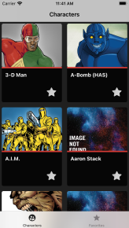
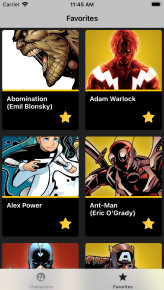
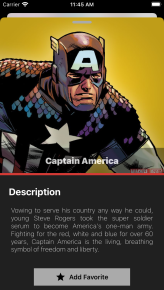

# App Marvel Challenge
 Aplicativo exibe personagens da `Marvel` (foto/nome/descrição) onde é possível adiciona-los como favorito.
 
  ### Projeto desenvolvido ultilizando:
  - [x] Swift 5
  - [x] MVC
  - [x] Storyboard usando auto layout (iPhone/ iPad)
  - [x] Animation
  - [x] Consumo webApi `Marvel` (https://developer.marvel.com/docs)
  - [x] Persistência local usando `CoreData`
  - [x] Gerenciamento de dependências usado `CocoaPods`
    - [x] Kingfisher (https://github.com/onevcat/Kingfisher)
    - [x] SwiftHash (https://github.com/onmyway133/SwiftHash)
  - [x] Verifica conexão com internet (https://github.com/Isuru-Nanayakkara/Reach)
  
 ## Print Screen :foggy:
 
|  | |  |
|:---:|:---:|:---:|
| Characters | Favorite | Character Detail |

## Gif :space_invader:

|  |
|:---:|
| App Marvel Challenge | 

